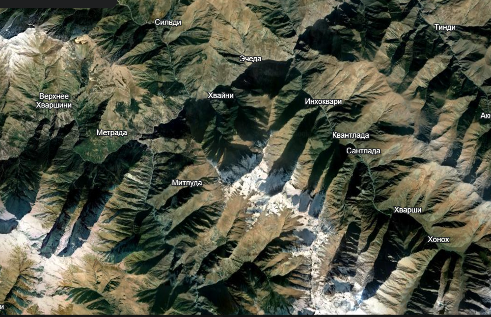

# Terrain Reconstruction from Satellite Images

This project implements a **fast shape-from-shading pipeline** using custom **SVD filtering**, gradient integration, and **3D terrain visualization**. It evaluates performance across multiple inputs.

---

## Project Structure


---

## Features

- **SVD-based image denoising** with adjustable rank `k`
- **Normal map estimation** using gradients
- **Shape from shading** using Lambertian model
- **3D terrain plot generation** (`matplotlib`)
- **Performance benchmarking**: execution time, surface variation

---

## Getting Started

### 1. Clone the repository

```bash
git clone https://github.com/EdvardStudent23/linear_project.git
cd linear_project
```

### 2. Run the script

```
python3 -m venv .venv
source .venv/bin/activate

pip install -r requirements.txt

python3 reconstruction.py
```

## Sample Images
    You may put the images, you want to try into src_images/



    example of an image


## How It Works

    Load and optionally filter image using SVD.

    Compute gradients and derive surface normals.

    Estimate shading via dot product with light direction.

    Recover surface height map using Poisson integration.

    Visualize the 3D terrain using matplotlib


## Output Samples

    Results are saved to the ```result_data/``` folder:

        depth_map.npy: Reconstructed depth values

        terrain_3d.png: Elevation surface plot


## Authors 
    Nazarii Dizhak
    Vitalii Lutsyk
    Student Edward
